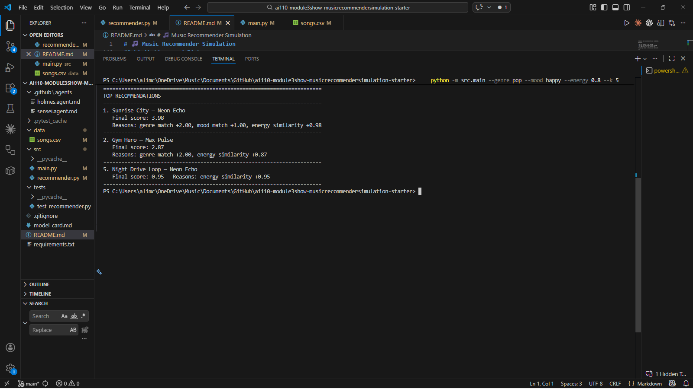

# 🎵 Music Recommender Simulation

## Project Summary

In this project you will build and explain a small music recommender system.

Your goal is to:

- Represent songs and a user "taste profile" as data
- Design a scoring rule that turns that data into recommendations
- Evaluate what your system gets right and wrong
- Reflect on how this mirrors real world AI recommenders

Replace this paragraph with your own summary of what your version does.

---

## How The System Works

Real-world music recommenders like Spotify or YouTube Music use massive amounts of data — your listening history, songs you skipped, time of day, what other users with similar taste enjoyed — and run it through complex machine learning models to predict what you'll want to hear next. They are constantly learning and updating. My version is much simpler, but it captures the same core idea: match a song's characteristics to what a user actually likes. Instead of learning from behavior over time, my system uses a hand-crafted scoring rule that directly compares a song's features to a user's stated preferences. The priority here is transparency — you can look at the score and understand exactly why a song ranked where it did, which is something real recommenders often can't offer.

### Song Features

Each `Song` object stores the following attributes used in scoring:

- `genre` — the broad musical category (e.g., pop, hip-hop, jazz)
- `mood` — the emotional tone of the track (e.g., happy, chill, intense)
- `energy` — a 0.0–1.0 float representing how intense or active the song feels
- `tempo_bpm` — beats per minute, how fast the song moves
- `valence` — a 0.0–1.0 float for how positive or upbeat the song sounds
- `danceability` — a 0.0–1.0 float for how suitable the song is for dancing
- `acousticness` — a 0.0–1.0 float indicating how acoustic (vs. electronic) the song is

### UserProfile Features

Each `UserProfile` stores the following preferences used to score songs:

- `favorite_genre` — the genre the user most wants to hear
- `favorite_mood` — the mood the user is in or prefers
- `target_energy` — the energy level the user is looking for (0.0–1.0)
- `likes_acoustic` — a true/false flag for whether the user prefers acoustic-sounding songs

### Scoring Algorithm Recipe

The recommender uses a point-based scoring system to rank songs:

| Factor | Points | Rule |
|--------|--------|------|
| **Genre match** | +2.0 | Exact match between song genre and user's `favorite_genre` |
| **Mood match** | +1.0 | Exact match between song mood and user's `favorite_mood` |
| **Energy similarity** | 0.0 to +1.0 | `1.0 - abs(song_energy - target_energy)`, scaled by 1.0 |
| **Tempo similarity** | 0.0 to +0.5 | Normalized distance from `target_tempo_bpm` (±160 BPM window) |
| **Valence similarity** | 0.0 to +0.4 | How close song valence is to `target_valence` |
| **Danceability similarity** | 0.0 to +0.4 | How close song danceability is to `target_danceability` |
| **Acousticness fit** | 0.0 to +0.3 | Based on user's acoustic preference |

**Maximum possible score:** ~4.5 points

**Example:** A "house" song with high energy (0.89), high danceability (0.91), and low acousticness (0.08) will score highest for a user who prefers `favorite_genre="house"`, `favorite_mood="euphoric"`, and targets high energy/danceability. In contrast, a "rock" song with intense mood and high energy will score lower for the same user unless rock is also a secondary preference.

This weighting balances precision (genre and mood are weighted heavily) with flexibility (numeric features allow near-matches to score well).

## Terminal Recommendation Output



### Data Flow Visualization

The system follows a simple three-step pipeline:

```
Input (User Prefs) → Process (Score each song) → Output (Top K ranked by score)
```

#### Step-by-Step Process:

1. **Input:** User provides a `taste_profile` with preferred genre, mood, and numeric targets.
2. **Process:** For each song in `data/songs.csv`, calculate a score by:
   - Adding 2.0 points if genre matches
   - Adding 1.0 point if mood matches
   - Adding similarity points (0.0–1.0) for energy, tempo, valence, danceability, acousticness
3. **Output:** Return the top K songs ranked by total score (highest first).

This transparent, explainable approach means you can see exactly *why* each song was recommended.

### Known Biases and Limitations

Because this system uses a hand-crafted scoring rule, it has predictable strengths and weaknesses:

- **Genre/Mood Over-Prioritization:** The system awards +2.0 and +1.0 points for exact genre and mood matches. If a song's genre doesn't match by name, it will score lower even if it's musically very similar. For example, "synthwave" songs might not match a user looking for "electronic" or "synth-pop."
- **Small Dataset Bias:** With only 18 songs, recommendations reflect whoever created this dataset. If only certain artists or eras are represented, the system will naturally favor them.
- **Binary Genre/Mood Matching:** The system checks for *exact* string matches. "hip-hop" ≠ "hip hop" ≠ "rap," which could lead to missed connections.
- **Ignores Lyrics and Artist:** The system doesn't consider song lyrics, artist popularity, or "cultural moment." A deep or controversial lyric won't change the score.
- **No Diversity Penalty:** If all top K recommendations happen to be from the same artist or share the same sub-genre, the system won't penalize or diversify automatically.
- **No Personalization Over Time:** Unlike Spotify or YouTube Music, this system doesn't learn from user behavior. The same `taste_profile` always produces the same ranking.

---

## Getting Started

### Setup

1. Create a virtual environment (optional but recommended):

   ```bash
   python -m venv .venv
   source .venv/bin/activate      # Mac or Linux
   .venv\Scripts\activate         # Windows

2. Install dependencies

```bash
pip install -r requirements.txt
```

3. Run the app:

```bash
python -m src.main
```

You can override the default taste profile from the command line:

```bash
python -m src.main --genre pop --mood happy --energy 0.8 --k 5
```

### Running Tests

Run the starter tests with:

```bash
pytest
```

You can add more tests in `tests/test_recommender.py`.

---

## Experiments You Tried

Use this section to document the experiments you ran. For example:

- What happened when you changed the weight on genre from 2.0 to 0.5
- What happened when you added tempo or valence to the score
- How did your system behave for different types of users

---

## Limitations and Risks

Summarize some limitations of your recommender.

Examples:

- It only works on a tiny catalog
- It does not understand lyrics or language
- It might over favor one genre or mood

You will go deeper on this in your model card.

---

## Reflection

Read and complete `model_card.md`:

[**Model Card**](model_card.md)

Write 1 to 2 paragraphs here about what you learned:

- about how recommenders turn data into predictions
- about where bias or unfairness could show up in systems like this


---

## 7. `model_card_template.md`

Combines reflection and model card framing from the Module 3 guidance. :contentReference[oaicite:2]{index=2}  

```markdown
# 🎧 Model Card - Music Recommender Simulation

## 1. Model Name

Give your recommender a name, for example:

> VibeFinder 1.0

---

## 2. Intended Use

- What is this system trying to do
- Who is it for

Example:

> This model suggests 3 to 5 songs from a small catalog based on a user's preferred genre, mood, and energy level. It is for classroom exploration only, not for real users.

---

## 3. How It Works (Short Explanation)

Describe your scoring logic in plain language.

- What features of each song does it consider
- What information about the user does it use
- How does it turn those into a number

Try to avoid code in this section, treat it like an explanation to a non programmer.

---

## 4. Data

Describe your dataset.

- How many songs are in `data/songs.csv`
- Did you add or remove any songs
- What kinds of genres or moods are represented
- Whose taste does this data mostly reflect

---

## 5. Strengths

Where does your recommender work well

You can think about:
- Situations where the top results "felt right"
- Particular user profiles it served well
- Simplicity or transparency benefits

---

## 6. Limitations and Bias

Where does your recommender struggle

Some prompts:
- Does it ignore some genres or moods
- Does it treat all users as if they have the same taste shape
- Is it biased toward high energy or one genre by default
- How could this be unfair if used in a real product

---

## 7. Evaluation

How did you check your system

Examples:
- You tried multiple user profiles and wrote down whether the results matched your expectations
- You compared your simulation to what a real app like Spotify or YouTube tends to recommend
- You wrote tests for your scoring logic

You do not need a numeric metric, but if you used one, explain what it measures.

---

## 8. Future Work

If you had more time, how would you improve this recommender

Examples:

- Add support for multiple users and "group vibe" recommendations
- Balance diversity of songs instead of always picking the closest match
- Use more features, like tempo ranges or lyric themes

---

## 9. Personal Reflection

A few sentences about what you learned:

- What surprised you about how your system behaved
- How did building this change how you think about real music recommenders
- Where do you think human judgment still matters, even if the model seems "smart"

